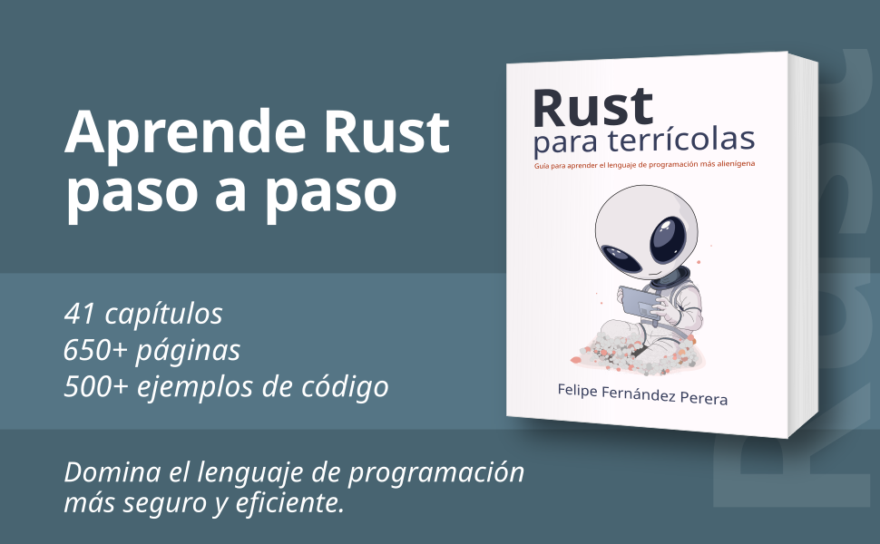

# Rust para terrícolas

Repositorio con parte del código utilizado a lo largo del libro "Rust para terrícolas".




## Sobre el libro

**Rust para terrícolas** recorre todos los conceptos que hacen único a **Rust**, paso a paso, con explicaciones claras, para mostrar el porqué de las cosas y desencadenar esos clics mentales necesarios para entender Rust y su filosofía.

El libro está organizado en 41 capítulos con más de 650 páginas de contenido útil.

Algunos de los contenidos del libro:


- Introducción a la gestión de memoria: *stack*, *heap*...
- El rico sistema de tipos de Rust: tupla, enum, struct...
- *Ownership*: variables propietarias.
- *Borrowing*: préstamos, referencias y el concepto de *lifetime*.
- Expresiones y la potencia de los patrones pattern matching.
- La gestión de errores a través de tipos de datos.
- Veremos los *slices* y los rangos.
- Representación de textos en Rust (`String`, `&str`...)
- Colecciones de la librería estándar: `Vec`, `VecDeque`, `HashMap`...
- Los *traits* de Rust y el comportamiento de los tipos de datos.
- Las construcciones genéricas: funciones, estructuras, *traits*.
- *Closures*, funciones de orden superior, iteradores...
- *Smart pointers* para gestionar contenido en memoria.
- Cómo estructurar los proyectos con *crates* y módulos.
- Concurrencia mediante los hilos de ejecución del sistema (*threads*).
- Concurrencia mediante programación asíncrona en Rust (*Future*, *async*, *await*...)
- Entrada-salida: ficheros, variables de entorno, entrada y salida estándar, redes...
- Pruebas unitarias integradas en Rust.
- Introducción a la arquitectura Functional Core, Imperative Shell.
- ...


[Más información sobre Rust para terrícolas](https://rustparaterricolas.com)


## Organización del código

Los capítulos del libro están representados en `src/caps/`

Cada capítulo es un módulo independiente, que contiene diferentes submódulos para separar y organizar los ejemplos de código de una forma más clara.

Cada submódulo incluye una función pública `run()`, que se encarga de ejecutar el código correspondiente.

Para ejecutar cada uno de esos submódulos:

```
cargo run -- castingas
cargo run -- declaracion
cargo run -- ownership
cargo run -- funciones
cargo run -- expresiones
cargo run -- if
cargo run -- tuplas
cargo run -- enums
cargo run -- match
cargo run -- option
cargo run -- structs
cargo run -- arrays
cargo run -- slices
cargo run -- vectores
cargo run -- strings
cargo run -- traits
cargo run -- generic
cargo run -- closures
cargo run -- colecciones
cargo run -- iteradores
cargo run -- bucles
cargo run -- smartpointers
cargo run -- casting
cargo run -- errores
cargo run -- lifetimes
cargo run -- threads
cargo run -- entradasalida
cargo run -- async
cargo run -- datetime
cargo run -- redes
cargo run -- arquitectura
```

La idea es que experimentes con el código para ir un paso más allá, ampliando los ejemplos del libro y adaptándolos según se te ocurra.

## Informar sobre errores

Si detectas cualquier tipo de error, tanto en el contenido del libro como en los ejemplos de código... o cualquier tipo de mejora o sugerencia, te estaré muy agradecido si me lo comunicas.

Puedes crear un *issue*, indicando el capítulo y el error (con información de contexto para que pueda localizar y revisar el error).

O puedes enviar un email a *felipe[at]rustparaterricolas.com*


## ¿Dónde puedo comprar el libro?

[Comprar libro en amazon.es](https://www.amazon.es/dp/8409843668/?tag=viajaporextre-21)

[Comprar libro en amazon.com](https://www.amazon.com/dp/8409843668/)

